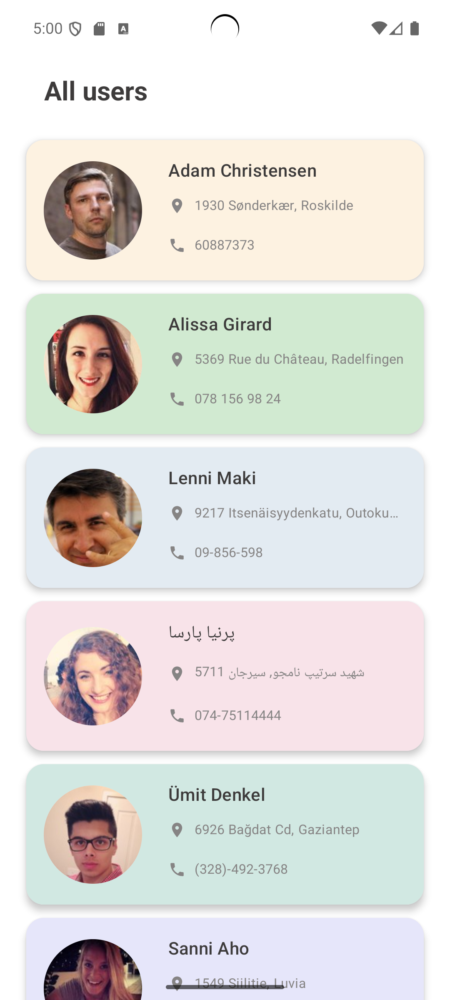
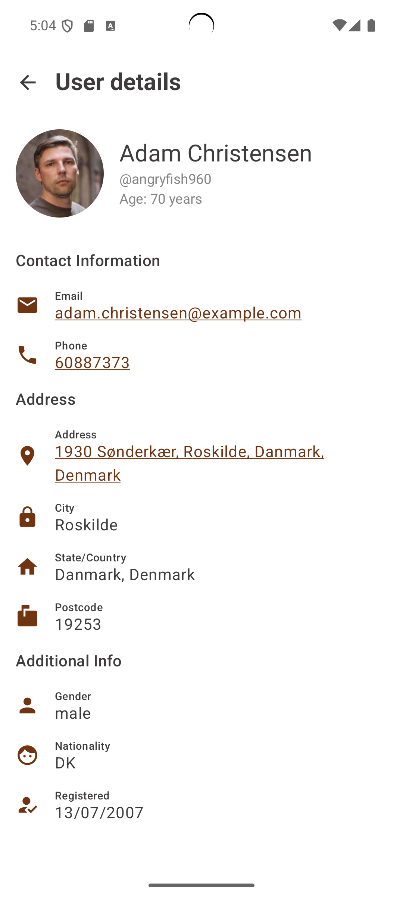
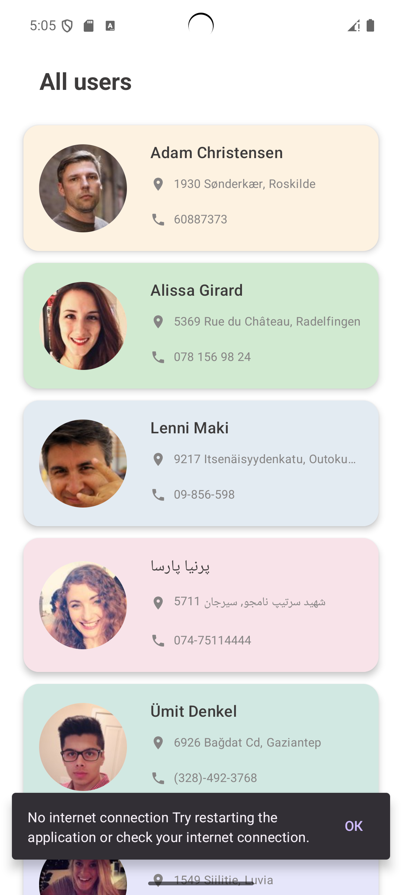

# UsersApp

**UsersApp** — это Android-приложение, которое отображает список пользователей с возможностью просмотра подробной информации. Данные загружаются с публичного API, а архитектура построена на принципах **MVVM + Clean Architecture**.  

Задание выполнено в полном объёме. Дополнительно реализована:  
🔹 Обработка ошибок  
🔹 Кэширование данных в Room  
🔹 Навигация между экранами
🔹 Внедрение зависимостей через Hilt

---

## Внешность

Главный экран | Детальный экран | Ошибка подключения  
:--:|:--:|:--:  
 |  | 
---

## ✅ Требования

### 🔹 Основной функционал

- [x] Загрузка пользователей с публичного API [`https://randomuser.me`](https://randomuser.me)
- [x] Отображение списка пользователей:  
  - Имя  
  - Email  
  - Аватар пользователя
- [x] Обновление списка через **Swipe-to-Refresh**
- [x] Переход на экран с деталями пользователя
- [x] Детальный экран отображает:  
  - Имя, username, email, телефон  
  - Адрес (улица, город)  
  - Название компании  
  - Кнопка "Назад"
- [x] Открытие внешних приложений:
  - При нажатии на **телефон** — запуск контактов
  - При нажатии на **email** — открытие почтового клиента
  - При нажатии на **адрес** — открытие карты


### 🔸 Дополнительные возможности

- [x] Обработка ошибок (отсутствие интернета, ошибки API)
- [x] Кэширование данных в **Room**
- [x] Плавная навигация между экранами с анимацией
- [x] Unit-тесты для ViewModel и UseCase (1–2 примера)

---

## Используемые технологии

- **Kotlin**
- **Retrofit** — работа с API
- **Room** — локальное кэширование
- **Jetpack Compose** — UI
- **ViewModel / StateFlow** — управление состоянием
- **Hilt** — внедрение зависимостей
- **Clean Architecture (data / domain / presentation)**
- **Coil** — загрузка изображений (опционально)
- **JUnit / MockK** — модульное тестирование

---

##  Запуск проекта

1. Клонировать репозиторий:
```bash
git clone https://github.com/arnolddds/usersApp_info_tecs_25.git
```

## Контакты
Телеграмм `@arnoldsss`
